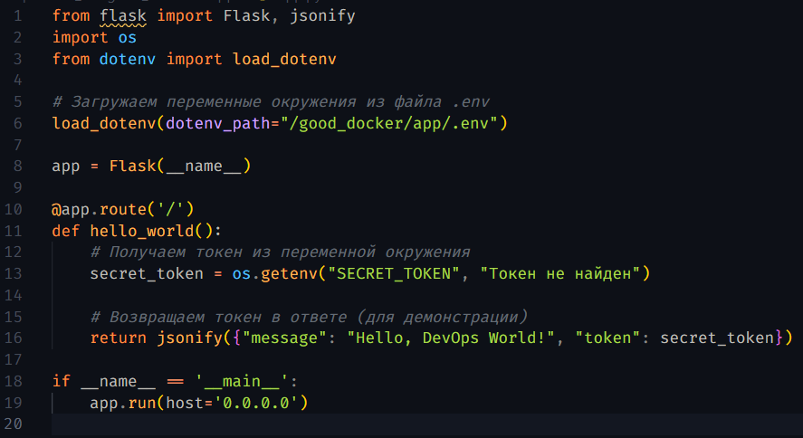
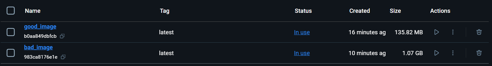
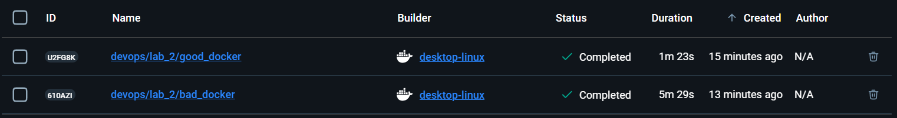
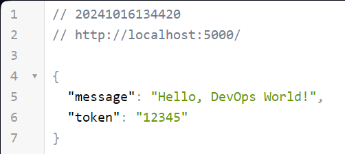
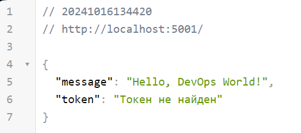
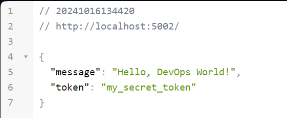
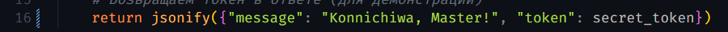
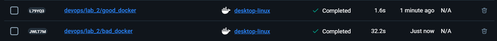

# DevOps

## Отчет по лабораторной работе №2

### Простое python-приложение

> Написать простое python-приложение, для которого будут писаться докерфайлы и собираться образы.

Напишем приложение, которое использует Flask и передает токен через переменные окружения:



---

### "Плохой" Dockerfile

> Написать “плохой” Dockerfile, в котором есть не менее трех “bad practices” по написанию докерфайлов

Напишем Dockerfile с плохими практиками:

```
    FROM python:3.7

    RUN apt-get update
    RUN apt-get install -y git
    RUN apt-get install -y curl

    WORKDIR /bad_docker

    ADD . .

    RUN pip install --no-cache-dir -r requirements.txt

    RUN echo "SECRET_TOKEN=12345" >> /bad_docker/app/.env

    CMD ["python", "app/app.py"]
```

Пройдемся по строкам файла и посмотрим, какие именно плохие практики тут были реализованы:

-   `FROM python:3.7`:

    -   **_Устаревший базовый образ_**: устаревший образ не получает обновлений безопасности и исправлений ошибок. Это делает систему уязвимой к потенциальным угрозам и может приводить к проблемам с совместимостью.

    -   **_Большой размер базового образа_**: тяжеловесные образы могут иметь большое множество ненужных для приложения зависимостей и инструментов, что увеличивает размер docker-образа и замедляет время его сборки и развертывания.

-   `RUN apt-get update`

    `RUN apt-get install -y git`

    `RUN apt-get install -y curl`

    -   **_Множество команд RUN без объединения_**: каждая инструкция создает свой слой, соответственно увеличивается их количество в самом образе.
    -   **_Установка ненужных пакетов_**: каждый пакет увеличивает итоговый размер образа, а значит, не нужно устанавливать лишние пакеты, только из-за того, что, возможно, они понадобятся, но приложение так ими и не воспользуется.
    -   **_Использование команды `RUN apt-get update` отдельно от `RUN apt-get install`_**: после сборки все слои находятся в кэше Docker, и если потом вы измените `apt-get install`, добавив дополнительный пакет, Docker пересоберет образ, начиная с измененной инструкции, а значит то, что было закэшировано в `apt-get update`, не изменится, и сборка потенциально получит старые версии пакетов.

-   `ADD . .`

    `RUN pip install --no-cache-dir -r requirements.txt`

    -   **_ADD вместо COPY для просто копирования файлов_**: инструкция ADD позволяет решать те же задачи, что и COPY, но у нее также есть и другие функции, которые могут дать нежелаемый результат сборки. Команда ADD может распаковать архивы или загружать файлы по URL, а значит, это может привести к ошибкам или стать причной уязвимостей.
    -   **_Неоптимальная установка зависимостей_**: при изменении докерфайла пересборка образа начинается с места изменения, а то, что было до него, хранится в кэше и не меняется. Таким образом, установка зависимостей сразу после копирования всех файлов приводит к тому, что при любом изменении кода Docker пересобирает и слои с зависимостями, что значительно замедляет сборку.

-   `RUN echo "SECRET_TOKEN=12345" >> /bad_docker/app/.env`

    -   **_Хранение конфиденциальной информации в слоях_**: если секреты или конфиденциальные данные добавляются в файлы в слоях, они остаются в истории слоёв Docker, даже если их удалить позже. Это может привести к утечке данных.

-   `CMD ["python", "app/app.py"]`

    -   **_Запуск от root пользователя_**: если не был создан пользователь с помощью инструкции USER, то по умолчанию контейнер будет запускаться от пользователя root, что представляет собой угрозу безопасности.

---

### "Хороший" Dockerfile

> Написать “хороший” Dockerfile, в котором эти плохие практики исправлены

Теперь исправим все ошибки и напишем оптимизированный и безопасный Dockerfile:

```
    FROM python:3.9-slim

    RUN apt-get update && apt-get install -y --no-install-recommends \
        && rm -rf /var/lib/apt/lists/*

    WORKDIR /good_docker

    COPY requirements.txt .

    RUN pip install --no-cache-dir -r requirements.txt

    COPY . .

    USER nobody

    CMD ["python", "app/app.py"]
```

Поясним, как именно были исправлены перечисленные плохие практики:

-   Используется актуальный и легковесный образ `python:3.9-slim`, который более безопасен, т.к. поддерживается на текущий момент, и занимает меньше места, потому что содержит лишь самые необходимые компоненты для Python-приложений.
-   Команды `RUN apt-get update` и `RUN apt-get install` объединены в одну строку через `&&` и отсутствует установка ненужных для нашего приложения пакетов.
-   Используется `COPY`, так как нам нужно просто скопировать файлы.
-   Конфиденциальные данные не сохраняются в слоях образа. Они будут передаваться через переменные окружения при запуске контейнера.
-   Добавлен пользователь `nobody`. Теперь приложение запускается от имени непривилегированного пользователя, что уменьшает риски.

---

### Вывод

> Описать как исправление плохих практик повлияло на результат

Соберем образы на основе написанных докерфайлов:

`docker build -t bad_image ./devops/lab_2/bad_docker`

`docker build -t good_image ./devops/lab_2/good_docker`

Что же мы можем заметить в результате наших исправлений:

-   **_Размер образа_**: за счет выбора легковесного образа размер собранного docker-образа уменьшился в несколько раз:

    

-   **_Скорость сборки_**: уменьшение размера образа, отсутствие установки ненужных пакетов повлияли на скорость сборки, он теперь собирается намного быстрее:

    

-   **_Безопасность_**: в хорошем образе теперь уделено больше внимания безопасности, т.к. теперь используется актуальный образ, добавлен пользователь без прав root, отсутствуют конфиденциальные данные в слоях образа. Снизу вы можете увидеть, что выводится при запуске контейнеров плохого и хорошего образов без указания параметров (кроме порта):

    `docker run -p 5000:5000 bad_image`

    

    `docker run -p 5000:5001 good_image`

    

    Как мы видим, в плохом примере мы можем получить токен без каких-либо особых сложностей, потому что он был добавлен прямо в образ. А в хорошем - токена нет, т.к. мы его не передавали. Так, давайте передадим токен во время запуска контейнера через переменные окружения.

    `docker run -p 5002:5000 -e SECRET_TOKEN=my_secret_token good_image`

    

    Таким образом, токен мы можем получить только, если сами его передадим при запуске контейнера.

-   **_Скорость пересборки_**: изменим код приложения, пусть в 16 строке теперь будет выводиться другое сообщение:

    

    Теперь нужно пересобрать образ, сделаем это и сравним время сборки:

    

    Пересборка хорошего образа осуществилась намного быстрее, чем плохого, благодаря оптимальной установке зависимостей в нем.

---

### Плохие практики при работе с контейнерами

> Описать 2 плохие практики по работе с контейнерами.

-   Не использовать централизованное логирование, чтобы собирать логи из контейнеров и облегчить их анализ. Docker предоставляет встроенные средства для просмотра логов контейнеров. Вы можете использовать команду docker logs [container-id] для просмотра логов контейнера. Чтобы следить за логами в реальном времени, используйте флаг -f или --follow: docker logs -f [container-id]. В больших системах и приложениях с множеством контейнеров централизованное логирование является ключевым аспектом для сбора и анализа логов. Это позволяет собирать логи из разных источников и агрегировать их в одном месте для анализа и мониторинга. Централизованные системы логирования, такие как ELK Stack или Graylog, обеспечивают возможности мониторинга логов на предмет аномалий и настройки оповещений. Вы можете настроить систему таким образом, чтобы получать оповещения при возникновении определенных событий или проблем, которые могут указывать на сбои, ошибки или угрозы безопасности.
-   Не настраивать сетевую изоляцию между контейнерами. Это может привести к тому, что контейнеры смогут взаимодействовать друг с другом без ограничений, что увеличит риск утечки данных и атак. Рекомендуется использовать пользовательские сети и контролировать, какие контейнеры могут обмениваться данными между собой. Плохой практикой будет не использовать Docker Compose, который создает изолированную сеть для приложений, описанных в docker-compose.yml. Все сервисы, определенные в этом файле, работают в рамках этой сети и имеют доступ друг к другу по имени сервиса. Это облегчает настройку взаимодействия между сервисами без необходимости указывать IP-адреса и порты.
