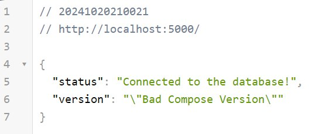
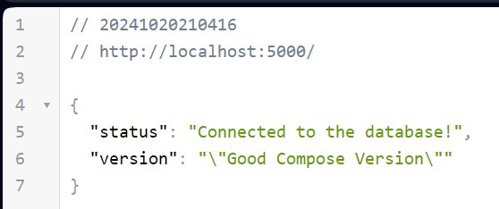
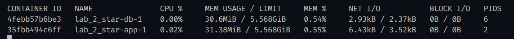
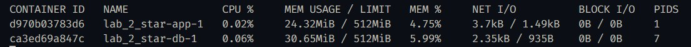
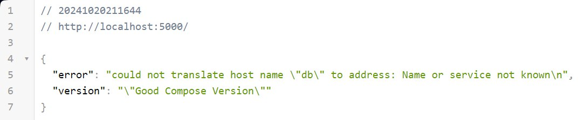

# Отчет по лабораторной работе №2 со звёздочкой

## Задание

> Написать простое python-приложение, для которого будут писаться докерфайлы и собираться образы.
> 1. Написать “плохой” Docker compose файл, в котором есть не менее трех “bad practices” по их написанию
> 2. Написать “хороший” Docker compose файл, в котором эти плохие практики исправлены
> 3. В Readme описать каждую из плохих практик в плохом файле, почему она плохая и как в хорошем она была исправлена, как исправление повлияло на результат
> 4. После предыдущих пунктов в хорошем файле настроить сервисы так, чтобы контейнеры в рамках этого compose-проекта так же поднимались вместе, но не "видели"
> друг друга по сети.


## Выполнили:
- Михайлов Юрий
- Христофоров Владислав
- Норкина Ярослава


Напишем python-приложение:
``` python
  from flask import Flask, jsonify
  import os
  import psycopg2

  app = Flask(__name__)

  # Настройки подключения к базе данных
  DB_HOST = os.getenv('DB_HOST', 'localhost')
  DB_NAME = os.getenv('DB_NAME', 'mydb')
  DB_USER = os.getenv('DB_USER', 'user')
  DB_PASSWORD = os.getenv('DB_PASSWORD', 'password')
  APP_VERSION = os.getenv('APP_VERSION', 'Unknown version')

  @app.route('/')
  def index():
      try:
          conn = psycopg2.connect(
              host=DB_HOST,
              database=DB_NAME,
              user=DB_USER,
              password=DB_PASSWORD
          )
          return jsonify({"status": "Connected to the database!", "version": APP_VERSION})
      except Exception as e:
          return jsonify({"error": str(e), "version": APP_VERSION}), 500

  if __name__ == '__main__':
      app.run(host='0.0.0.0', port=5000)
```

А также создадим образ на основе докерфайла:
```
FROM python:3.11-slim

WORKDIR /app

RUN apt-get update && apt-get install -y iputils-ping

COPY requirements.txt .

RUN pip install --no-cache-dir -r requirements.txt

COPY . .

EXPOSE 5000

CMD ["python", "app.py"]
```

---

### "Плохой" Docker Compose file

> Написать “плохой” Docker compose файл, в котором есть не менее трех “bad practices” по их написанию

Напишем Docker Compose файл с плохими практиками:

```
  version: "3"

  services:
      app:
          build: ./app
          ports:
              - "5000:5000"
          environment:
              - DB_HOST=db
              - DB_NAME=mydb
              - DB_USER=user
              - DB_PASSWORD=password
              - APP_VERSION="Bad Compose Version"
          networks:
              - default

      db:
          image: postgres
          environment:
              POSTGRES_DB: mydb
              POSTGRES_USER: user
              POSTGRES_PASSWORD: password
          ports:
              - "5432:5432"
          volumes:
              - db_data_bad:/var/lib/postgresql/data
          networks:
              - default

  volumes:
      db_data_bad:

  networks:
      default:
          driver: bridge
```

Опишем подробно плохие практики, которые были реализованы:

-   Неявное использование версии образа для базы данных:
  `db:
          image: postgres`

    -   Используется образ без указания версии, что может привести к проблемам с совместимостью.


-  Отсутствие зависимости между сервисами:

    -   Нет параметра **_depends_on_**
    -   Отсутствие зависимостей между последовательностью загрузки приложения и базы данных
    -   Приложение может обращаться к базе данных, что вызовет ошибку

-  Отсутствие ограничений ресурсов:

    -   Нет параметра **_resources: limits:_**
    -   Необходимо ограничить работу процессора и выделяемую память для контейнера
    -   Без ограничений контейнеры могут использовать слишком много ресурсов хоста, что может привести к деградации производительности других процессов и сервисов.

---

### "Хороший" Docker Compose file

> Написать “хороший” Docker compose файл, в котором эти плохие практики исправлены

Теперь исправим все ошибки и добавим недостающие параметры:

```
  version: "3.8"

  services:
      app:
          build: ./app
          ports:
              - "5000:5000"
          environment:
              - DB_HOST=db
              - DB_NAME=mydb
              - DB_USER=user
              - DB_PASSWORD=password
              - APP_VERSION="Good Compose Version"
          depends_on:
              - db
          deploy:
              resources:
                  limits:
                      cpus: "0.5"
                      memory: 512M
          networks:
              - default

      db:
          image: postgres:13.4
          environment:
              POSTGRES_DB: mydb
              POSTGRES_USER: user
              POSTGRES_PASSWORD: password
          ports:
              - "5432:5432"
          volumes:
              - db_data_good:/var/lib/postgresql/data
          deploy:
              resources:
                  limits:
                      cpus: "0.5"
                      memory: 512M
          networks:
              - default

  volumes:
      db_data_good:

  networks:
      default:
          driver: bridge
```

Исправления в "хорошем" файле:

-   Добавлена явная версия образа `postgres:13.4`.
-   Добавлен параметр depends_on, гарантирующий запуск базы данных перед приложением.
-   Ограничено использование процессора до 0.5 и памяти до 512M.

---

### Вывод

> Описать, как исправление повлияло на результат

Соберем контейнер при помощи Docker compose:

`docker-compose -f docker-compose.good.yml build`

`docker-compose -f docker-compose.bad.yml build`

Затем запустим при помощи следующих команд:

`docker-compose -f docker-compose.bad.yml up`



  `docker-compose -f docker-compose.good.yml up`



Как изменился результат после испраdления файла:

-   **_Посмотрим на логи_**: для этого запустим команду `docker stats`:

    

-   **_Добавим ограничения_**:  заметна разница по использованию памяти:

    

Команды для остановки контейнеров:
`docker-compose -f docker-compose.good.yml down`
`docker-compose -f docker-compose.bad.yml down`

---
### Сложности при выполнении 1-3 пунктов


---
### Настройка compose-проекта

> Настроить сервисы так, чтобы контейнеры в рамках этого compose-проекта так же поднимались вместе, но не "видели"
> друг друга по сети.

Настроим изоляцию для хорошего docker compose файла. Изначально в нем нет изоляции, так что пакеты отправляются успешно из одного контейнера в другой:


Добавим настройки для сетей:


Теперь после пересборки и запуска при попытке пинговать ничего не получается


Это же можно увидеть в браузере



**_Таким образом,_** удалось успешно запустить при помощи Docker Compose небольшое веб-приложение, были выполнены базовые настройки для запуска контейнера Docker при помощи новых
программных инструментов. Мы узнали, как наиболее эффективно и правльно пользоваться Docker Compose и настраивать взаимодействие внутри сети.


