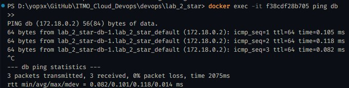
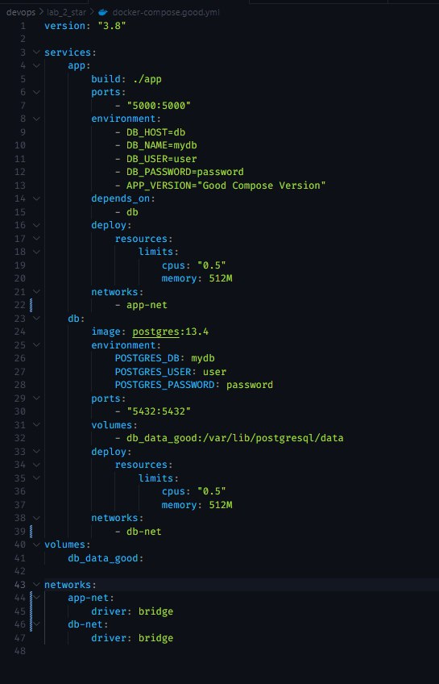

# Отчет по лабораторной работе №2 со звёздочкой

## Задание

> 1. Написать “плохой” Docker compose файл, в котором есть не менее трех “bad practices” по их написанию
> 2. Написать “хороший” Docker compose файл, в котором эти плохие практики исправлены
> 3. В Readme описать каждую из плохих практик в плохом файле, почему она плохая и как в хорошем она была исправлена, как исправление повлияло на результат
> 4. После предыдущих пунктов в хорошем файле настроить сервисы так, чтобы контейнеры в рамках этого compose-проекта так же поднимались вместе, но не "видели"
>    друг друга по сети.

## Выполнили:

-   Михайлов Юрий
-   Христофоров Владислав
-   Норкина Ярослава

---

### Подготовка

В качестве сервисов у нас будут простое Flask-приложение, взаимодействующая с базой данных Postgres.

Напишем python-приложение:

```python
  from flask import Flask, jsonify
  import os
  import psycopg2

  app = Flask(__name__)

  DB_HOST = os.getenv('DB_HOST', 'localhost')
  DB_NAME = os.getenv('DB_NAME', 'mydb')
  DB_USER = os.getenv('DB_USER', 'user')
  DB_PASSWORD = os.getenv('DB_PASSWORD', 'password')
  APP_VERSION = os.getenv('APP_VERSION', 'Unknown version')

  @app.route('/')
  def index():
      try:
          conn = psycopg2.connect(
              host=DB_HOST,
              database=DB_NAME,
              user=DB_USER,
              password=DB_PASSWORD
          )
          return jsonify({"status": "Connected to the database!", "version": APP_VERSION})
      except Exception as e:
          return jsonify({"error": str(e), "version": APP_VERSION}), 500

  if __name__ == '__main__':
      app.run(host='0.0.0.0', port=5000)
```

А также напишем Dockerfile для приложения:

```
FROM python:3.11-slim

WORKDIR /app

RUN apt-get update && apt-get install -y iputils-ping

COPY requirements.txt .

RUN pip install --no-cache-dir -r requirements.txt

COPY . .

EXPOSE 5000

CMD ["python", "app.py"]
```

---

### "Плохой" Docker Compose file

> Написать “плохой” Docker compose файл, в котором есть не менее трех “bad practices” по их написанию

Напишем Docker Compose файл с плохими практиками:

```
  version: "3"

  services:
      app:
          build: ./app
          ports:
              - "5000:5000"
          environment:
              - DB_HOST=db
              - DB_NAME=mydb
              - DB_USER=user
              - DB_PASSWORD=password
              - APP_VERSION="Bad Compose Version"
          networks:
              - default

      db:
          image: postgres
          environment:
              POSTGRES_DB: mydb
              POSTGRES_USER: user
              POSTGRES_PASSWORD: password
          ports:
              - "5432:5432"
          volumes:
              - db_data_bad:/var/lib/postgresql/data
          networks:
              - default

  volumes:
      db_data_bad:

  networks:
      default:
          driver: bridge
```

Опишем подробно плохие практики, которые были реализованы:

-   Неявное использование версии образа для базы данных:
    `db:
        image: postgres`

    -   Используется образ без указания версии, что значит, что версия будет установлена по умолчанию (последняя в данный момент). А значит, разработчики могут столкнуться с несовместимостью версии для базы данных.

-   Отсутствие зависимости между сервисами:

    -   Нет директивы `depends_on`, то есть отсутствует зависимость между последовательностью запуска приложения и базы данных, что может привести к проблемам, т.к. приложение может попытаться подключиться к базе данных до того, как она будет готова к приему соединений, что вызовет ошибки подключения

-   Отсутствие ограничений ресурсов:

    -   В файле нет ограничения на используемые сервисами ресурсы. Без ограничений контейнеры могут использовать слишком много ресурсов хоста, что может привести к снижении производительности других процессов и сервисов. Ограничения ресурсов можно сделать с помощью директивы `deploy.resources.limits`.

---

### "Хороший" Docker Compose file

> Написать “хороший” Docker compose файл, в котором эти плохие практики исправлены

Теперь исправим все ошибки и добавим недостающие директивы:

```
  version: "3.8"

  services:
      app:
          build: ./app
          ports:
              - "5000:5000"
          environment:
              - DB_HOST=db
              - DB_NAME=mydb
              - DB_USER=user
              - DB_PASSWORD=password
              - APP_VERSION="Good Compose Version"
          depends_on:
              - db
          deploy:
              resources:
                  limits:
                      cpus: "0.5"
                      memory: 512M
          networks:
              - default

      db:
          image: postgres:13.4
          environment:
              POSTGRES_DB: mydb
              POSTGRES_USER: user
              POSTGRES_PASSWORD: password
          ports:
              - "5432:5432"
          volumes:
              - db_data_good:/var/lib/postgresql/data
          deploy:
              resources:
                  limits:
                      cpus: "0.5"
                      memory: 512M
          networks:
              - default

  volumes:
      db_data_good:

  networks:
      default:
          driver: bridge
```

Исправления в "хорошем" файле:

-   Добавлена явная версия образа `postgres:13.4`.
-   Добавлен `depends_on`, гарантирующий запуск базы данных перед приложением.
-   Ограничено использование процессора и памяти.

---

### Вывод

> Описать, как исправление повлияло на результат

Соберем контейнеры при помощи Docker compose:

`docker-compose -f docker-compose.good.yml build`

`docker-compose -f docker-compose.bad.yml build`

Затем запустим при помощи следующих команд и посмотрим результат, чтобы убедиться, что все работает нормально:

`docker-compose -f docker-compose.bad.yml up`


`docker-compose -f docker-compose.good.yml up`


Посмотрим на метрики запущенных контейнеров при помощи `docker stats`, чтобы убедиться, что ограничение ресурсов работает:

При запуске плохого файла:


При запуске хорошего файла:


Команды для остановки контейнеров:

`docker-compose -f docker-compose.good.yml down`

`docker-compose -f docker-compose.bad.yml down`

---

### Сложности при выполнении

Были сложности при запуске хорошего compose-файла после плохого. Дело в том, что при сборке плохого compose-файла использовалась последняя версия базы данных 17, а при запуске хорошего compose-файла использовалась уже конкретная версия 13.4. Проблема была в том, что база данных в хорошем не поднималась вместе с приложением, т.к. они оба использовали одну и ту же директорию для хранения базы данных, и в ней уже после запуска плохого была другая версия, из-за чего возникал конфликт. Это было решено с помощью разделения директорий для хорошего и для плохого compose-файла директивой `volumes`.

---

### Настройка сетевой изоляции

> Настроить сервисы так, чтобы контейнеры в рамках этого compose-проекта так же поднимались вместе, но не "видели" друг друга по сети.

Настроим изоляцию для хорошего docker compose файла. Изначально в нем нет изоляции, так что пакеты отправляются успешно из одного контейнера в другой:



Добавим настройки для сетей:



Теперь после пересборки и запуска при попытке пинговать ничего не получается


Это же можно увидеть в браузере


**_Таким образом,_** удалось успешно запустить при помощи Docker Compose небольшое веб-приложение, были выполнены базовые настройки для запуска контейнера Docker при помощи новых
программных инструментов. Мы узнали, как наиболее эффективно и правльно пользоваться Docker Compose и настраивать взаимодействие внутри сети.
