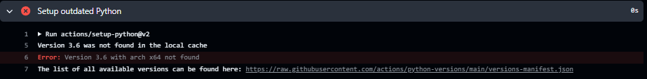
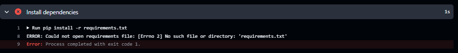
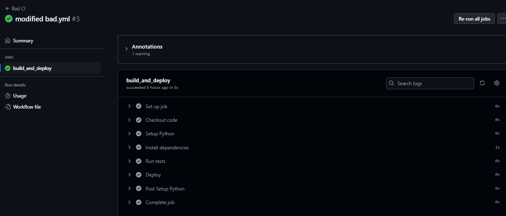
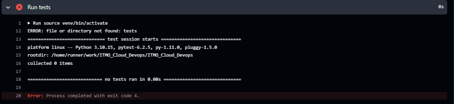
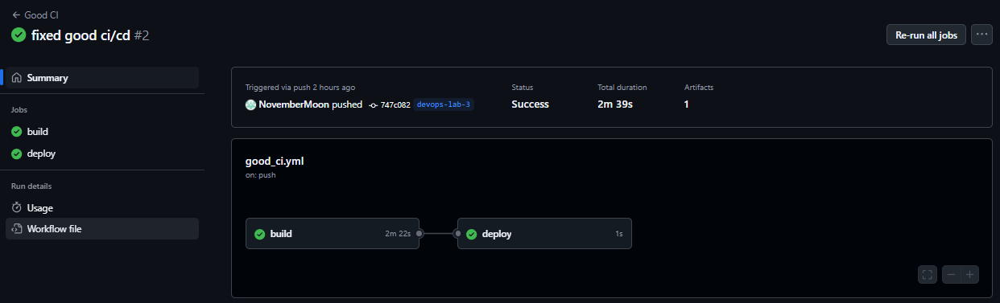

# Отчет по лабораторной работе №3

## Задание

> 1. Написать “плохой” CI/CD файл, который работает, но в нем есть не менее пяти “bad practices” по написанию CI/CD
> 2. Написать “хороший” CI/CD, в котором эти плохие практики исправлены
> 3. В Readme описать каждую из плохих практик в плохом файле, почему она плохая и как в хорошем она была исправлена, как исправление повлияло на результат
> 4. Прочитать историю про Васю (она быстрая, забавная и того стоит): https://habr.com/ru/articles/689234/

## Выполнили:

-   Христофоров Владислав
-   Михайлов Юрий
-   Норкина Ярослава

---

## Подготовка

В качестве примера используем простое Python-приложение с тестами.

<details> <summary>Напишем python-приложение:

<code>app/main.py</code></summary>

```python
def add(a, b):
    return a + b

def subtract(a, b):
    return a - b

if __name__ == "__main__":
    print("2 + 1 =", add(2, 1))
    print("2 - 1 =", subtract(2, 1))
```

</details><details> <summary>Также простенькие тесты:

<code>tests/test_main.py</code></summary>

```python
import unittest
from app.main import add, subtract

class TestMathOperations(unittest.TestCase):
    def test_add(self):
        self.assertEqual(add(1, 2), 3)
        self.assertEqual(add(-2, 1), -1)

    def test_subtract(self):
        self.assertEqual(subtract(2, 1), 1)
        self.assertEqual(subtract(0, 0), 0)

if __name__ == '__main__':
    unittest.main()
```

</details> <details> <summary>И зависимости для тестов

<code>requirements.txt</code></summary>
```python
pytest==6.2.5
```
</details>

Скрипт для *CI* пишется на *YAM*L в файле с расширением *.yml* непосредственно в корне проекта. Создадим там папку *.github* с вложенной папкой *workflows*, здесь и будем писать наши "плохой" и "хороший" *CI/CD* файлы.

---

## "Плохой" CI/CD файл

> Написать “плохой” CI/CD файл, который работает, но в нем есть не менее пяти “bad practices” по написанию CI/CD

В файле **bad_ci.yml** напишем:

```yml
name: Bad CI

on:
  push:
    branches:
      - '*' # (1) Неоптимальные триггеры для сборок — запускается при пуше в любую ветку
  pull_request:
    branches:
      - '*' # (1) То же самое для pull_request в любую ветку

jobs:
  build_and_deploy: # (2) Нет разделения логики на разные jobs; всё в одном
    runs-on: ubuntu-latest

    steps:
      - name: Checkout code
        uses: actions/checkout@v1 # (3) Устаревшие версии экшенов

      - name: Setup Python
        uses: actions/setup-python@v2 # (3) Устаревшие версии экшенов
        with:
          python-version: '3.10'

      - name: Install dependencies 
        # (4) Нет кэширования зависимостей
        # (5) Установка без виртуального окружения
        run: |
          pip install -r devops/lab_3/requirements.txt

      - name: Run tests
        run: |
          pytest
        continue-on-error: true # (6) Игнорирование ошибок тестирования

      - name: Deploy
        # (7) Жёстко закодированный секрет
        run: | 
          echo "Deploying to production with SECRET=hardcoded_secret"
```

В файле уже указаны какие плохие практики мы реализовали, но давайте опишем их подробнее:

1. Неоптимальные триггеры для сборок

   - В нашем случае триггеры настроены на запуск при любом пуше или пулл реквесте в любую ветку, что приводит к избыточным сборкам и расходу ресурсов. Вообще триггеры можно написать и для изменений файлов, и их тоже можно плохо написать, если не указать конкретные пути.

2. Нет разделения логики на разные jobs

    - Сборка и деплой выполняются в одном job, что затрудняет переиспользование артефактов и управление процессом. При ошибке будет труднее понять, где она произошла.

3. Устаревшие версии экшенов

    - Использование старых версий экшенов  (`actions/checkout@v1, actions/setup-python@v2`) может приводить к проблемам безопасности и отсутствию новых функций.

4. Нет кэширования зависимостей

    - При каждом запуске зависимости устанавливаются заново, что увеличивает время сборки и расход ресурсов.

5. Установка зависимостей без виртуального окружения

    - Глобальная установка пакетов может приводить к конфликтам версий и непредсказуемому поведению.

6. Игнорирование ошибок тестирования

    - Параметр `continue-on-error: true` позволяет продолжать выполнение workflow даже при неудачных тестах, что может привести к деплою нерабочего кода.

7. Жёстко закодированные секреты

    - Хранение секретов в открытом виде угрожает безопасности проекта, так как секреты могут быть случайно раскрыты.

---

### "Хороший" CI/CD файл

> Написать “хороший” CI/CD, в котором эти плохие практики исправлены

Теперь исправим все плохое и напишем хорошее в **good.ci_yml**:

```yml
name: Good CI

on: # Ограничение триггеров только необходимыми ветками     
  push:
    branches:
      - main 
      - devops-lab-3
  pull_request:
    branches:
      - main

jobs:
  build:
    runs-on: ubuntu-latest

    steps:
      - name: Checkout code
        uses: actions/checkout@v3  # Использование актуальной версии экшена

      - name: Setup Python
        uses: actions/setup-python@v4  # Использование актуальной версии экшена
        with:
          python-version: '3.10'

      - name: Cache dependencies
        uses: actions/cache@v3  # Кэширование зависимостей
        with:
          path: ~/.cache/pip
          key: ${{ runner.os }}-pip-${{ hashFiles('devops/lab_3/requirements.txt') }}
          restore-keys: |
            ${{ runner.os }}-pip-

      - name: Install dependencies (venv)
        # Использование виртуального окружения
        run: |
          python -m venv venv  
          source venv/bin/activate
          pip install --upgrade pip
          pip install -r devops/lab_3/requirements.txt

      - name: Run tests
        # Тесты теперь обязательно должны завершиться успешно
        run: |
          source venv/bin/activate
          pytest

      - name: Build artifact
        run: |
          mkdir -p build
          echo "Build artifact content" > build/artifact.txt

      - name: Upload artifact
        uses: actions/upload-artifact@v3
        with:
          name: my-app-build
          path: build/

  deploy:
    runs-on: ubuntu-latest
    needs: build  # Отдельный job, зависимый от успешного завершения build

    steps:
      - name: Download artifact
        uses: actions/download-artifact@v3
        with:
          name: my-app-build
          path: build/

      - name: Deploy
        env:
          SECRET: ${{ secrets.MY_APP_SECRET }}  # Использование секретов GitHub
        run: |
          echo "Deploying to production with SECRET=${SECRET}"
```

Что было исправлено в "хорошем" файле:

1. Ограничение триггеров для сборки

    - **Что изменилось**: уточнены ветки, при пуше или пулл реквесте на которые будет происходить сборка.
    - **А почему**: сборка будет происходить только в необходимых случаях, увеличивая эффективность CI/CD процессов.


2. Использование актуальных версий экшенов

    - **Что изменилось**: обновлены версии экшенов до последних стабильных (`actions/checkout@v3, actions/setup-python@v4`).
    - **А почему**: новые версии экшенов содержат улучшения, исправления ошибок и обновления безопасности.

3. Кэширование зависимостей

    - **Что изменилось**: добавлен шаг `Cache dependencies` с использованием `actions/cache@v3` для кэширования зависимостей.
    - **А почему**: ускоряет процесс установки пакетов, избегая повторных загрузок при каждом запуске workflow.

4. Использование виртуального окружения

    - **Что изменилось**: добавлен шаг `Install dependencies (venv)` для создания и активации виртуального окружения.
    - **А почему**: изолирует зависимости проекта от системных пакетов, предотвращая конфликты версий и обеспечивая стабильность.

5. Управление ошибками тестов
    - **Что изменилось**: удалён параметр `continue-on-error: true` в шаге `Run tests`.
    - **А почему**: обеспечивает остановку workflow при неудачных тестах, предотвращая деплой нерабочего кода.

6. Разделение задач сборки и деплоя

    - **Что изменилось**: разделены процессы сборки (build) и деплоя (deploy) на разные jobs.
    - **А почему**: обеспечивает четкое разделение ответственности, повышает безопасность и позволяет управлять процессом деплоя независимо от сборки.

7. Использование секретов

    - **Что изменилось**: настроено использование GitHub Secrets (MY_APP_SECRET) для безопасного деплоя.
    - **А почему**: снижает риск утечки данных и уязвимости.


---

## Просмотр работы CI/CD

Коммитим и пушим изменения. Затем в репозитории в разделе `Actions` смотрим на статусы наших worlkflows.

### Запуск "плохого" workflow.

В начале были проблемы с выполнением. При первой попытке у нас появилась ошибка из-за версии python. Хотели с устаревшей версией экшена сделать и устаревший python (что видно из названия шага), но не получилось.



Поэтому просто поменяли версию python на актуальную.

Затем появилась вторая ошибка. Не был найден файл с зависимостями, а это потому что он был внутри папки с этой лабой, а искали его снаружи в корне репозитория.



Исправили путь установки.

На этом все закончилось и workflow наконец выполнился.



---

### Запуск "хорошего" workflow.

При первом запуске опять появилась ошибка. На этот раз был неправльно указан путь до тестов.



Исправили и снова запустили.

Все отлично заработало!



## Заключение

**Таким образом,** мы написали "плохой" и "хороший" CI/CD файлы, узнали о плохих практиках написания CI/CD файлов, научились их правильно и эффективно писать, чтобы оптимизировать workflow и лучше управлять процессом CI/CD, и в итоге нам удалось успешно их запустить.
