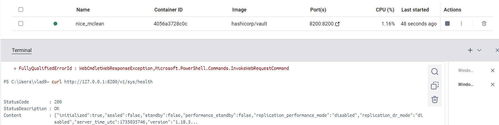
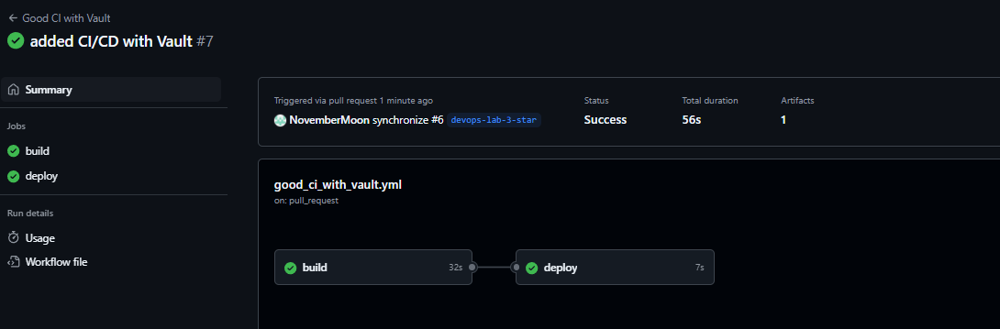

# Отчет по лабораторной работе №3 со звездочкой

## Задание

> Сделать красиво работу с секретами. Например, поднять Hashicorp Vault (или другую секретохранилку) и сделать так, чтобы ci/cd пайплайн (или любой другой ваш сервис) ходил туда, брал секрет, использовал его не светя в логах. В Readme аргументировать почему ваш способ красивый, а также описать, почему хранение секретов в CI/CD переменных репозитория не является хорошей практикой.

---

## Выполнили:

-   Христофоров Владислав
-   Михайлов Юрий
-   Норкина Ярослава

---

## Подготовка

Для выполнения нам будет нужна сделанная обычная третья лаба.

### Выбор инструмента

---

В качестве безопасной секретохранилки будем использовать предложенный Hashicorp Vault. Почему? А потому что у него следующие преимущества:

- **Централизованное управление**. Все секреты хранятся в одном защищенном месте, и доступ к нему можно получить только через API. Это упрощает их управление и контроль доступа.

- **Гибкие политики доступа**. Можно создать столько токенов для доступа и управления секретами, сколько нужно, и дать им те разрешения, которые необходимы и достаточны.

- **Аудит и мониторинг**. Можно отслеживать запросы к Vault по детализированный логам доступа.

- **Безопасность данных**. Секреты шифруются как в покое, так и при передаче.

- **Поддержка полного жизненного цикла секрета**. Cоздание, отзыв, завершение срока хранения, продление.

И отсюда можно сразу понять, почему хранение секретов в репозитории не является хорошей практикой. А именно:

- Секреты, хранящиеся в переменных репозитория, могут быть случайно раскрыты через логи или ошибки в коде.

- Нет гибкой настройки доступов к секретам.

- Нет единого места для мониторинга и аудита использования секретов.

- Нет поддержки полного жизненного цикла.

- При увеличении числа проектов в инфраструктуре управление секретами становится сложнее, да и каждый проект с секратами может представлять угрозу.

### Настройка Hashicorp Vault и Интеграция с GitHub Actions

---

Установим Vault. Для нашей работы сделаем это с помощью Docker и запустим для простоты в режиме разработки, это упростит настройку, но, конечно, для продакшена так не надо делать:

`docker pull hashicorp/vault`

`docker run --cap-add=IPC_LOCK -e 'VAULT_DEV_ROOT_TOKEN_ID=novkyn' -e 'VAULT_DEV_LISTEN_ADDRESS=0.0.0.0:8200' -p 8200:8200 hashicorp/vault`

Контейнер успешно запустился. Сохраним токен в секретах GitHub.



Добавим секреты в Vault. Все будем делать внутри контейнера:

```
# Инициализация KV secret engine
docker exec -e VAULT_ADDR='http://127.0.0.1:8200' -e VAULT_TOKEN='novkyn' -it 4056a3728c0c vault secrets enable -version=2 kv

# Добавление секрета
docker exec -e VAULT_ADDR='http://127.0.0.1:8200' -e VAULT_TOKEN='novkyn' -it 4056a3728c0c vault kv put kv/myapp MY_APP_SECRET="emptysecret"
```
Теперь сделаем настройку доступа GitHub Actions к Vault с помощью `AppRole`. Но для начала создадим файл `myapp-policy.txt`, в котором напишем политику для доступа к секретам:

```
path "kv/data/myapp" {
  capabilities = ["read"]
}
```

Скопируем файл в контейнер, создадим политику и AppRole с этой политикой:

```
# копирование
docker cp /myapp-policy.txt 4056a3728c0c:/myapp-policy.txt

# создание политики
docker exec -e VAULT_ADDR='http://127.0.0.1:8200' -e VAULT_TOKEN='novkyn' -it 4056a3728c0c vault policy write myapp-policy myapp-policy.txt

# включение механизма аутентификации AppRole
docker exec -e VAULT_ADDR='http://127.0.0.1:8200' -e VAULT_TOKEN='novkyn' -it 4056a3728c0c vault auth enable approle

# создание AppRole с политикой
docker exec -e VAULT_ADDR='http://127.0.0.1:8200' -e VAULT_TOKEN='novkyn' -it 4056a3728c0c vault write auth/approle/role/myapp-role token_policies="myapp-policy" token_ttl=1h token_max_ttl=4h
```

Получим `Role ID` и `Secret ID`
```
docker exec -e VAULT_ADDR='http://127.0.0.1:8200' -e VAULT_TOKEN='novkyn' -it 4056a3728c0c vault read auth/approle/role/myapp-role/role-id

docker exec -e VAULT_ADDR='http://127.0.0.1:8200' -e VAULT_TOKEN='novkyn' -it 4056a3728c0c vault write -f auth/approle/role/myapp-role/secret-id
```

Сохраним их в секретах GitHub в нашем репозитории.

Теперь же так как Vault запущен локально, придется перебрасывать порт. Для этого используем `ngrok`, это делается предельно просто, поэтому не будем расписывать. От него мы получим URL, который также добавим в секреты GitHub.

---

## Обновление Workflow 

В файл `good_ci.yml` добавим новые шаги для Vault, а именно, установку Vault CLI, аутентификацию, получение секретов и проверку получения секрета. Изменения сохраним в новом файле `good_ci_with_vault.yml`.

Используем уже существующий экшен для Vault `hashicorp/vault-action`:

```yml
name: Good CI with Vault

on:
  push:
    branches:
      - main
      - devops-lab-3
  pull_request:
    branches:
      - main

jobs:
  build:
    runs-on: ubuntu-latest

    steps:
      - name: Checkout code
        uses: actions/checkout@v3

      - name: Setup Python
        uses: actions/setup-python@v4
        with:
          python-version: '3.10'
      - name: Cache dependencies
        uses: actions/cache@v3
        with:
          path: ~/.cache/pip
          key: ${{ runner.os }}-pip-${{ hashFiles('devops/lab_3/requirements.txt') }}
          restore-keys: |
            ${{ runner.os }}-pip-

      - name: Install dependencies (venv)
        run: |
          python -m venv venv
          source venv/bin/activate
          pip install --upgrade pip
          pip install -r devops/lab_3/requirements.txt

      - name: Install Vault CLI  # Установка Vault CLI, чтобы использовать команды vault
        run: |
          curl -fsSL https://apt.releases.hashicorp.com/gpg | gpg --dearmor > hashicorp.gpg
          sudo install -o root -g root -m 644 hashicorp.gpg /usr/share/keyrings/hashicorp-archive-keyring.gpg
          echo "deb [signed-by=/usr/share/keyrings/hashicorp-archive-keyring.gpg] https://apt.releases.hashicorp.com $(lsb_release -cs) main" | sudo tee /etc/apt/sources.list.d/hashicorp.list
          sudo apt-get update && sudo apt-get install vault

      - name: Authenticate with Vault # Аутентификация
        uses: hashicorp/vault-action@v2
        with:
          url: ${{ secrets.VAULT_ADDR }}
          method: approle
          roleId: ${{ secrets.VAULT_ROLE_ID }}
          secretId: ${{ secrets.VAULT_SECRET_ID }}

      - name: Retrieve secrets from Vault # Получение секрета
        id: secrets
        run: |
          export VAULT_ADDR="${{ secrets.VAULT_ADDR }}"
          export VAULT_TOKEN="${{ secrets.VAULT_TOKEN }}"
          MY_APP_SECRET=$(vault kv get -field=MY_APP_SECRET kv/myapp)
          echo "::set-output name=my_app_secret::$MY_APP_SECRET"

      - name: Validate Secret # шаг просто для проверки получения секрета
        run: |
          if [ -z "${{ steps.secrets.outputs.my_app_secret }}" ]; then
            echo "Секрет не получен из Vault."
            exit 1
          else
            echo "Секрет успешно получен."
          fi

      - name: Run tests
        run: |
          source venv/bin/activate
          pytest

      - name: Build artifact
        run: |
          mkdir -p build
          echo "Build artifact content" > build/artifact.txt

      - name: Upload artifact
        uses: actions/upload-artifact@v3
        with:
          name: my-app-build
          path: build/

  deploy:
    runs-on: ubuntu-latest
    needs: build

    steps:
      - name: Download artifact
        uses: actions/download-artifact@v3
        with:
          name: my-app-build
          path: build/

      - name: Deploy
        env:
          SECRET: ${{ secrets.MY_APP_SECRET }}
        run: |
          echo "Deploying to production with SECRET=${SECRET}"
```

---

## Просмотр работы CI/CD

Коммитим и пушим изменения, создаем пулл реквест. Затем в репозитории в разделе `Actions` смотрим на статусы наших worlkflows. 

Не без проблем, но мы смогли сделать так, чтобы все заработало:



## Заключение

**Таким образом,** мы добавили интеграцию Vault с GitHub Actions, узнали, как это все делается, в итоге смогли успешно запустить workflow.


